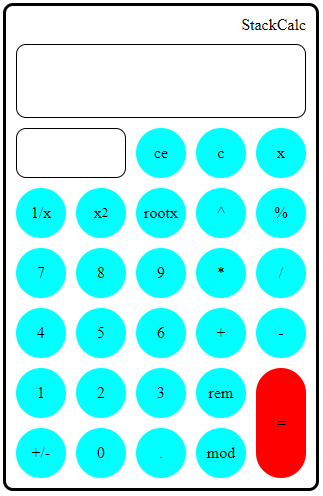

# CALCULATOR

***A Frontend Project***
 
 

---
Hii everyone, Welcome to ReadMe of This project
This is a calculator website

## Tools/Techonologies Used
- VSCode
- HTML
- CSS
- JAVASCRIPT

## Idea used
- Used Stack for the calculation
- Your Expression [Inorder] to [postorder] than it's evaluation

## Differnce between this and others
> Maximum of projects [Calculator] on YouTube is made using a function eval which has lots of bugs, Know What do i mean by bugs
1.While taking input you can write as many operators as you can
2.some bugs in equal key when it is pressed th expression is not checked direct evaluated means it will run fine if you write true or valid expression

## What I did
- Used a Variable which catchs the type of input as operator or operand or equal
- Tracking previous input
- some expressions need single operand customized it in different way

## Some features Added
> you can use your keyboards to operate it it as all buttons bind to a keyboard listener
>you can see whole expression continuosly and what you are giving input in different field

